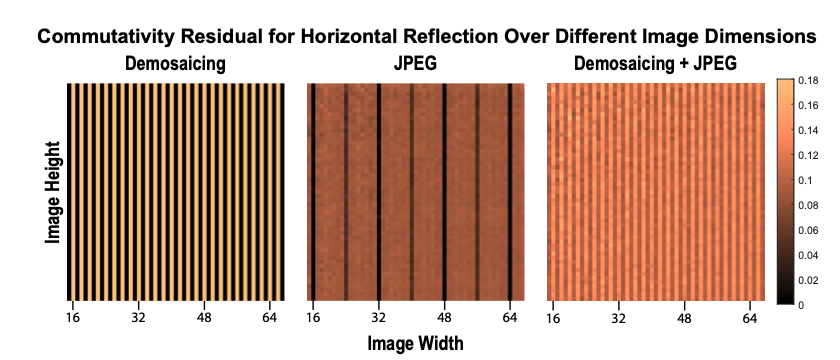
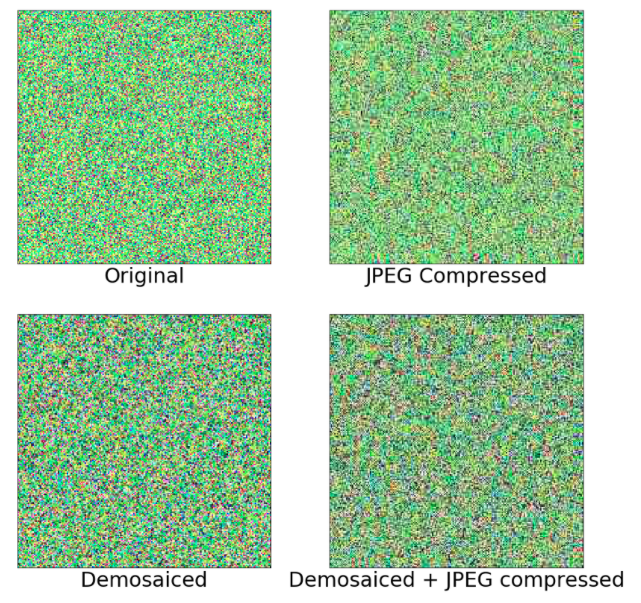

# Visual Chirality (CVPR2020 Best Paper Nominee) [[www](http://bit.ly/visual-chirality)]

## Introduction
This repository provides supplemental code of [*Visual Chirality*](http://bit.ly/visual-chirality) paper.

> [**Visual Chirality**](http://bit.ly/visual-chirality),            
> [Zhiqiu Lin](https://linzhiqiu.github.io), [Jin Sun](http://www.cs.cornell.edu/~jinsun/), 
[Abe Davis](http://abedavis.com), [Noah Snavely](https://www.cs.cornell.edu/~snavely/)     
> *IEEE Computer Vision and Pattern Recognition, 2020, Oral Presentation* 

For a brief overview of the paper, please check out our oral presentation video!
<p align="center"><a target=_blank href="https://www.youtube.com/watch?v=gc5IvTozU9M&feature=youtu.be"></a></p>


## Repository Overview

This repository contains all the code and experiments that appear in the supplemental material of our paper for reproducibility.

In specific, we provide a jupyter notebook [`CommutativeTestDemo.ipynb`](CommutativeTestDemo.ipynb) for both **commutative tests** and **glide commutative tests** between mirror reflection and several imaging operations, including bayer-demosaicing, JPEG compression, and their composition.
<p align="center"></p>

We also provide a PyTorch implementation of the learning experiments that predict the random horizontal reflections of synthetic processed images.
<p align="center"></p>

## Commutative Test
Please open and run jupyter notebook [`CommutativeTestDemo.ipynb`](CommutativeTestDemo.ipynb) for details.

## Learning Experiments on Synthetic Images
- `train.py`: includes training and validation scripts.
- `config.py`: contains arguments for data preparation, model definition, and imaging details.
- `exp.sh` : contains the experiments script to run.
- All other helper modules :
  - `dataset_factory.py`: prepares PyTorch dataloaders of processed images.
  - `global_setting.py`: contains all supporting demosaicing algorithms and model definitions.
  - `utils.py`: contains functions to generate random images and compute mosiaced/demosaiced/compressed images.
  - `tools.py`: A variety of helpers to get PyTorch optimizer/schedular and logging directory names.

The code is developed using python 3.6.10. NVIDIA GPUs are needed to train and test.
It is suggested to use anaconda to install any dependecies required in this repo.


#### Learning Results without random cropping

The below table is the results of the synthetic processed images experiments using random gaussian images of different dimensions as well as various processing methods (**without random cropping**). Please refer to our supplemental material for details about training. All the test results followed the prediction of the commutative tests in [`CommutativeTestDemo.ipynb`](CommutativeTestDemo.ipynb).

| Image Processing | Image Size | Test Accuracy  |  
|------------------|------------|----------------|
| Bayer-Demosaicing| 99         | 50%  |
| JPEG Compression | 99         | 99%  | 
| Both             | 99         | 99%  |  
| Bayer-Demosaicing| 100         | 99%  |
| JPEG Compression | 100         | 99%  | 
| Both             | 100         | 99%  |  
| Bayer-Demosaicing| 112         | 99%  |
| JPEG Compression | 112         | 50%  | 
| Both             | 112         | 99%  |  

#### Learning Results with random cropping

With **random cropping**, we can still train network to predict random horizontal reflections on Bayer-demosaiced + JPEG compressed randomly generated gaussian images. We use a cropping size of 512, and in order to eliminate the chance of the network cheating by utilizing the boundary of images (e.g., JPEG edge artifacts), we crop from the center (544, 544) of (576, 576) images. The results again followed our prediction in paper, and they are shown in the following table:

| Image Processing | Image Size | Crop Size| Test Accuracy  |  
|------------------|------------|----|----------------|
| Bayer-Demosaicing| 576 |    512    | 50%  |
| JPEG Compression | 576 |    512    | 50%  | 
| **Both**             | **576** |    **512**   | **99%**  |  

### Citation
If this work is useful for your research, please cite our paper:
```
@InProceedings{chirality20,
  title={Visual Chirality},
  author = {Zhiqiu Lin and Jin Sun and Abe Davis and Noah Snavely},
  booktitle={Computer Vision and Pattern Recognition (CVPR)},
  year={2020}
}
```

### License
This code is freely available for free non-commercial use, and may be redistributed under these conditions. 
Third-party datasets and softwares are subject to their respective licenses. 
